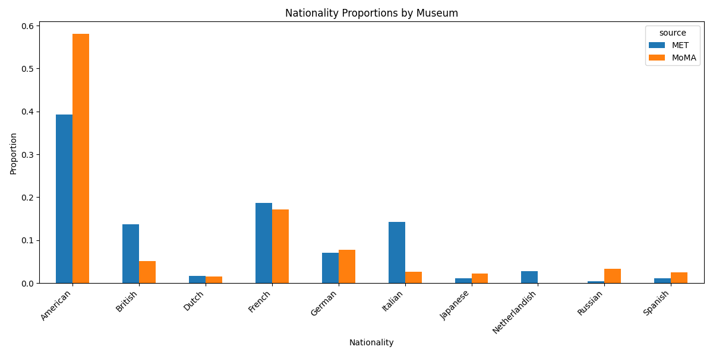
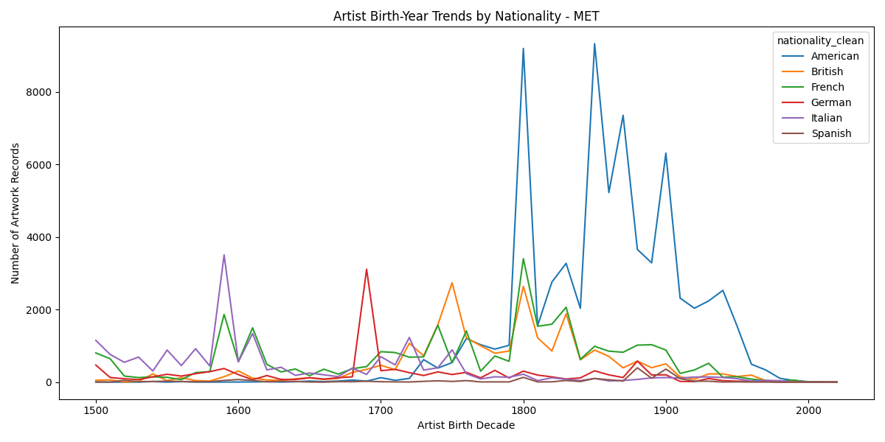
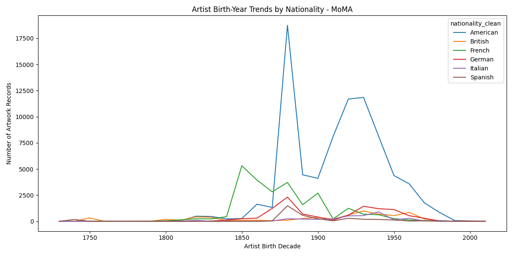

# Geographic Representation in the MoMA and MET Museums

---

## Contributors
- Renee Huang (reneeh3)  
- Sarah Kim (yewonwk2)
  
---

## Summary

This project looks into the influence of the geographic origin of artists in major museums, specifically the Metropolitan Museum of Art (MET) and the Museum of Modern Art (MoMA). Museums are key in shaping and preserving cultural and social narratives by selecting which artworks to keep and preserve. This means representation is an important area to study.

Our main research question is:
* How does the geographic origin of artists influence their representation in major museums?

Support questions include:
* Which nationalities or regions are the most represented?
* Are there differences between MoMA and MET collections?
* How has representation changed over time (with the measure being the artists' birthdays)?

We used publicly available datasets from both museums, cleaned and standardized key variables, and prepared them to be merged. Some of our preliminary findings from both are:
- Representation is heavily concentrated in a few dominant regions, particularly the Americas and Europe, indicating a strong Western bias in the collection.
- There is evidence of increasing geographic diversity in more recent periods, with a gradual rise in artists from non-Western regions.
- Despite this shift, regions such as Africa and parts of Asia remain underrepresented, suggesting persistent historical imbalances in global art representation.

---

## Data Profile

### Dataset 1: *MoMA: Artists.txt*
- **Location in repository:** [MoMA:Artists.txt](https://github.com/reneeh3/is477/blob/main/MoMA%20datasets/Artists.txt.zip)
- **Source:** Open-access dataset [MoMA github link](https://github.com/museumofmodernart/collection), [Dataset accessed April 1st, 2026](https://media.githubusercontent.com/media/MuseumofModernArt/collection/43399bad2fad626a0750ab6801ced6f1e83b0a41/Artists.csv)
- **Description:** Contains key information about individual artist profiles in the MoMA collections by artist ID number. The dataset is derived from MoMA's internal collections database and includes only accessioned and catalogued works. It reflects institutional decisions and curation, so it is not a complete representation of all artists. Some records are marked as not curatorially approved, so the metadata may be incomplete or unverified. 
- **Structure:**
  - Format: CSV (UTF-8 encoded)
  - Rows: 15,859 individual artists
  - Columns: 9 variables
    -   `ConstituentID`: Artist unique identifier
    -   `DisplayName`: Artist name
    -   `ArtistBio`: Short artist biography
    -   `Nationality`: Country of citizenship
    -   `Gender`
    -   `BeginDate`: Birth year
    -   `EndDate`: Death year
    -   `Wiki QID`: URL for artist "About me's"
    -   `ULAN`:  Catalog for artists [artist](https://www.getty.edu/research/tools/vocabularies/ulan/index.html)
  - Primary identifier: `ConstituentID`
- **Content & characteristics:** This is an artist-level dataset with demographic and biographical attributes like nationality, gender, birth years, and death years. Most variables are categorical and text fields, with `BeginDate` and `EndDate` as numeric year fields. There are 137 unique nationalities and 7 gender values (see later in data cleaning that most of these are syntactic errors). There are many missing values in `ArtistBio` (2,188 missing), `Nationality` (2,500 missing), `Gender` (3,282 missing), `Wiki QID` (12,611 missing), and `ULAN` (12,927 missing)
- **Ethical/legal considerations:** This dataset reflects institutional curation decisions and may not represent all artists. Additionally, demographic attributes such as nationality and gender are assigned by the museum and may not fully reflect how individuals identify.
- **Relevance to research questions:** The dataset provides the artists' nationalities and birthdate information needed to analyze geographic origin. It is generally more accurate and/or filled out than the Artwork dataset. It will let us study the background represented in MoMA and to compare it with the MET dataset.

### Dataset 2: *MoMA: Artworks.txt*
- **Location in repository:** [MoMA: Artworks.txt](https://github.com/reneeh3/is477/blob/main/MoMA%20datasets/Artworks.txt.zip)
- **Source:** Open-access dataset [MoMA github link](https://github.com/museumofmodernart/collection), [Dataset Accessed April 1st, 2026](https://media.githubusercontent.com/media/MuseumofModernArt/collection/a46be68e826552737fce8152b002dcd603c0a300/Artworks.csv)
- **Description:** This dataset includes information about the MoMA collection's artworks. The dataset is derived from MoMA's internal collections database and includes only accessioned and catalogued works. It reflects institutional decisions and curation, so it is not a complete representation of all artworks. Some records are marked as not curatorially approved, so the metadata may be incomplete or unverified. 
- **Structure:**
  - Format: CSV (UTF-8 encoded)
  - Rows: 160,632 individual artworks
  - Columns:
    - `Title`: Title of artwork  
    - `Artist`: Name of artist  
    - `ConstituentID`: Artist identifier (links to Artists dataset)  
    - `ArtistBio`: Short description of the artist  
    - `Nationality`: Artist nationality  
    - `BeginDate`: Artist birth year  
    - `EndDate`: Artist death year  
    - `Gender`: Artist gender  
    - `Date`: Year or year range the artwork was created  
    - `Medium`: Materials used to create  
    - `Dimensions`: Physical size description  
    - `Classification`: Type of artwork (e.g., architecture, sculpture)  
    - `Department`: Museum department  
    - `CreditLine`: Acquisition credit  
    - `AccessionNumber`: Unique accession number  
    - `DateAcquired`: Date the museum acquired the artwork  
    - `Cataloged`: Whether the item is cataloged  
    - `ObjectID`: Unique artwork identifier  
    - `URL`: Link to artwork page  
    - `ImageURL`: Link to artwork image  
    - `OnView`: Whether the artwork is currently on display  
    - `Circumference (cm)`  
    - `Depth (cm)`  
    - `Diameter (cm)`  
    - `Height (cm)`  
    - `Length (cm)`  
    - `Weight (kg)`  
    - `Width (cm)`  
    - `Seat Height (cm)`  
    - `Duration (sec.)`  

  - Primary identifier: `ObjectID`
- **Content & characteristics:** This is an artwork-level dataset that is linked to the artists dataset through `ConstituentID`. It has very descriptive metadata and numerical measurement fields for physical art. The dataset has 8 unique departments and 42 unique classifications. While MoMA’s full collection contains nearly 200,000 works, this dataset includes only those that have been digitized/cataloged, so some artists, regions, or time periods may be underrepresented.
- **Ethical/legal considerations:** This dataset reflects institutional cataloging decisions and may not represent the full range of artworks. Metadata quality varies across records, and incomplete or inconsistent artist information may affect interpretations of representation.
- **Relevance to research questions:** This dataset shows which artists are actually represented in MoMA through their artworks in the collection. Linking artists to the artworks, it helps measure how frequently each geographic origin appears. It also allows for analysis of representation across departments and classifications if interested.

The museum periodically updates both MoMA datasets. This project uses a snapshot of the data accessed on April 1, 2026, and results may differ if the dataset is updated in the future. They are also both released under a CC0 public domain license, allowing unrestricted use. However, MoMA requests proper attribution, and any modifications to the dataset should be clearly indicated.

### Dataset 3: *MET: MetObjects.csv*
- **Location in repository:** [MetObjects_csv.zip](https://github.com/reneeh3/is477/blob/88d9c8cc519c2e3528372bedea528e0b20797174/Met%20datasets/MetObjects_csv.zip)
- **Source:** Open-access dataset [Met Github link](https://github.com/metmuseum), [Dataset accessed April 2026](https://github.com/metmuseum/openaccess)
- **Description:** This dataset contains information about artworks and associated artist metadata from the Metropolitan Museum of Art collection. Unlike the MoMA datasets, which separate artists and artworks into different files, the MET dataset stores both artwork-level and artist-level information within a single table. The dataset is derived from the museum’s internal collections database and includes only digitized and cataloged works, reflecting institutional acquisition and curation decisions rather than a complete representation of all artworks or artists.  
- **Structure:**
  - Format: CSV (UTF-8 encoded)
  - Rows: ~70,000 records (reduced for this project)
  - Columns: 9 variables  
    - `Object ID`: Unique artwork identifier  
    - `Object Number`: Museum accession number  
    - `Title`: Title of artwork  
    - `Artist Display Name`: Artist name  
    - `Artist Nationality`: Artist nationality  
    - `Artist Begin Date`: Artist birth year (text format)  
    - `Artist End Date`: Artist death year (text format)  
    - `Object Date`: Artwork creation date  
    - `Constituent ID`: Artist identifier  
  - Primary identifier: `Object ID`  
- **Content & characteristics:** This is a combined artwork-artist dataset that includes both descriptive metadata and artist demographic information. The dataset required preprocessing to standardize column names, extract year values from text fields, and clean nationality data. Compared to the MoMA datasets, it is less structured and contains inconsistencies such as missing values and varied formatting. The dataset used in this project is a sampled and reduced version to meet file size constraints and improve computational efficiency.  
- **Ethical/legal considerations:** This dataset reflects curatorial and institutional decisions regarding which artworks are collected and cataloged, and therefore does not represent a complete or unbiased sample of global art. Some fields contain missing or inconsistent data, which may affect analysis. Additionally, nationality labels are assigned by the museum and may not fully reflect artists’ identities. The dataset is released under an open-access policy for research and educational use.  
- **Relevance to research questions:** This dataset provides both artwork-level and artist-level information needed to analyze geographic representation in the MET collection. By cleaning and standardizing key variables such as nationality and birth year, it enables direct comparison with the MoMA dataset to examine patterns of representation across institutions.

### Overall Data Considerations

The datasets used in this project are publicly available through museum open-access initiatives. The MoMA dataset is released under a CC0 public domain license, and the MET dataset is provided through the Metropolitan Museum of Art Open Access program. Both datasets permit unrestricted use for research and educational purposes.

Despite their accessibility, the data reflects institutional curation and cataloging practices, which may introduce bias in terms of which artists and artworks are included. As a result, the datasets should not be interpreted as complete representations of global artistic production.

From a structural perspective, both datasets required standardization to ensure comparability, including aligning variable names, cleaning categorical values, and handling missing or inconsistent entries. These preprocessing steps were necessary to produce a reliable and consistent dataset for analysis.

---

## Data Quality

To assess data quality, we examined completeness, consistency, and accuracy across key variables. A primary focus was on identifying missing values, as these directly impact our ability to analyze artist representation. For MoMA, there were many incomplete and inconsistent variables. Generally, the percentage for the important variables required for analysis was not very concerning, and the higher missingness variables are only apparent in less critical information such as size or web links to the works. For the MET dataset, data quality challenges were primarily related to inconsistencies in formatting, the presence of missing values in artist-related fields, and the structure of the dataset itself. 

**MoMA Artists.txt:**
- **High missingness:**
  - There are **2 variables** with extremely high levels of missing data. However, these were not important to the question we're evaluating.

    - `ULAN`: 12,927 missing (~81.5%)  
    - `Wiki QID`: 12,611 missing (~79.5%)  

- **Moderate missingness:**
  - Several variables have noticeable but less severe missing data:

    - `Gender`: 3,282 missing (~20.7%)  
    - `Nationality`: 2,500 missing (~15.8%)  
    - `ArtistBio`: 2,188 missing (~13.8%)  

- **No missing values:**
  - The following key variables are fully filled out:
  
    - `ConstituentID`  
    - `DisplayName`  
    - `BeginDate`  
    - `EndDate`  

**MoMA Artworks.txt**
- **High missingness:**
  - There are **10 variables** with extremely high levels of missing data. However, these were both not important to the central question or exclusive to digital/physical artworks so they are blank on purpose.

    - `Seat Height (cm)`: 160,632 missing (100%)  
    - `Circumference (cm)`: 160,622 missing (~99.99%)  
    - `Weight (kg)`: 160,332 missing (~99.81%)  
    - `Length (cm)`: 159,898 missing (~99.54%)  
    - `OnView`: 159,345 missing (~99.20%)  
    - `Diameter (cm)`: 159,237 missing (~99.13%)  
    - `Duration (sec.)`: 158,651 missing (~98.77%)  
    - `Depth (cm)`: 141,944 missing (~88.36%)  

  - The rest of the variables have **moderate missingness**:
    - `ImageURL`: 67,397 missing (~41.96%)  
    - `URL`: 58,958 missing (~36.71%)  
    - `Medium`: 9,162 missing (~5.70%)  
    - `Dimensions`: 8,739 missing (~5.44%)  
    - `DateAcquired`: 5,467 missing (~3.40%)
   
**MET: MetObjects.csv**
- **High missingness:**
  - There are several variables with extremely high levels of missing data. However, these variables are not central to the research question or are dependent on the type of artwork, so missing values are expected.

    - `Artist End Date`: frequently missing (especially for living artists)  
    - `Artist Gender`: missing for a large portion of records  
    - `Medium`: high missingness for certain object types  
    - `Dimensions`: often missing or incomplete depending on artwork  
    - `Object Date`: sometimes missing or inconsistently recorded  

- **Moderate missingness:**
  - Some key variables contain noticeable but manageable levels of missing data:

    - `Artist Nationality`: missing or inconsistent in a portion of records  
    - `Artist Begin Date`: occasionally missing or stored in non-standard formats  
    - `Artist Display Name`: mostly complete but occasionally missing  

- **Low or no missingness:**
  - The following variables are largely complete and reliable:

    - `Object ID`: primary identifier (no missing values)  
    - `Object Number`: accession number  
    - `Title`: artwork title

### Metadata and Accessibility

The datasets used in this project follow FAIR principles. All data is stored in CSV format (UTF-8 encoded) and was accessed as a snapshot in April 2026. Variables were standardized across datasets to ensure interoperability. All datasets and derived outputs are stored with clear filenames and documented within the repository to support findability and reuse.

### Overall assessment:

Overall, the MoMA and MET datasets are rich in information but require significant preprocessing to be suitable for analysis. While missing values and inconsistencies are present in both datasets, most critical variables needed for the research question—such as artist name, nationality, and birth year—can be cleaned and standardized effectively. By filtering incomplete records, standardizing key fields, and reducing the datasets to relevant variables, we were able to produce high-quality derived datasets suitable for analyzing geographic representation. These datasets reflect institutional collection practices, which should be considered when interpreting results.

---

## Data Cleaning

The data cleaning process involved multiple stages of preprocessing, standardization, and integration to ensure that both the MoMA and MET datasets were consistent, comparable, and suitable for analysis. Cleaning was performed using a combination of Python and OpenRefine, where Python handled systematic transformations and OpenRefine supported manual inspection and correction of inconsistencies. These cleaning and transformation decisions directly influence how representation is measured, particularly by ensuring that nationality counts reflect consistent and comparable values across datasets.

### Python Cleaning

Initial data cleaning was conducted in Python for both datasets. While similar cleaning strategies were applied, the structure of the MoMA and MET datasets required different approaches.

For the MoMA data, two separate datasets (`Artists.txt` and `Artworks.txt`) were cleaned independently before being merged. Column names were standardized by converting them to lowercase and replacing spaces with underscores. Text fields were trimmed, and numeric fields such as `constituentid`, `begindate`, and `enddate` were converted to numeric types, with placeholder values such as `0` replaced with missing values. Custom functions were created to standardize nationality and gender values by removing unnecessary formatting and mapping equivalent values (e.g., “USA,” “US,” and “United States”) to a single standardized form.

A key difference in the MoMA dataset was the presence of multiple artists associated with a single artwork. To address this, the `constituentid` field was parsed and the dataset was exploded so that each artwork-artist pair was represented as a separate row. This ensured that each record contained only one artist and prevented multiple nationalities from being stored in a single cell. After cleaning, the artist dataset was merged with the artwork dataset using `constituentid`, and artist-level demographic variables were prioritized when duplicates existed.

In contrast, the MET dataset consisted of a single table (`MetObjects.csv`) that already contained both artist and artwork information. As a result, no merging was required. However, the dataset required additional preprocessing due to inconsistent formatting and larger size. Column names were standardized in the same way as MoMA, and text fields were cleaned. Date fields were often stored as text, so a function was implemented to extract valid four-digit years for consistent numerical analysis. Nationality values were also standardized using mapping functions to address inconsistencies similar to those found in the MoMA dataset.

Since the MET dataset contained many variables not relevant to the research question, it was reduced to a subset of key variables (title, artist name, birth year, death year, and nationality). These variables were selected because they directly support analysis of geographic representation while removing unnecessary metadata that would not contribute to the research question. This also ensured consistency with the MoMA dataset structure while improving efficiency and reducing noise in the analysis.

For both datasets, duplicate records and invalid rows (e.g., missing critical values such as artist name or nationality) were removed to improve overall data quality and ensure that each observation was meaningful.

### OpenRefine Cleaning

After Python preprocessing, both datasets were imported into OpenRefine for additional standardization. OpenRefine was primarily used to inspect and correct inconsistencies in the nationality field, which remained one of the most complex variables.

Using text faceting and clustering, variations of the same nationality were identified and standardized (e.g., duplicate values, trailing symbols, and spelling inconsistencies). Multi-valued nationality fields were split into separate entries using OpenRefine’s multi-valued cell functions, and whitespace was trimmed to ensure consistency.

Additional transformations included renaming columns for clarity and removing unnecessary variables such as measurement fields, URLs, and other metadata that were not relevant to the research question. OpenRefine complemented the Python cleaning process by enabling efficient manual corrections that were difficult to fully automate.

To ensure transparency, all OpenRefine transformations have been exported and included in the repository as `apply_openrefine.json`.

### Data Integration

After cleaning both datasets, they were standardized to a common schema consisting of the following variables: `title`, `artist_name`, `artist_birthyear`, `artist_deathyear`, and `nationality_clean`.

The MoMA dataset required merging of artist and artwork data, while the MET dataset did not require merging due to its single-table structure. Once both datasets were aligned to the same format, they were combined using vertical integration (row-wise concatenation). A new variable, `source`, was added to indicate whether each record originated from MoMA or MET. The integrated dataset reflects institutional collection practices, which may influence representation patterns.

This integration strategy allows for direct comparison between the two museums while preserving the structure and meaning of each dataset.

### Overall Workflow

The overall workflow followed a structured pipeline:

1. Load raw datasets
2. Clean and standardize variables using Python
3. Apply manual corrections using OpenRefine
4. Integrate datasets into a unified schema
5. Perform analysis and visualization

---
  
## Findings
The comparative analysis of the cleaned datasets from the Metropolitan Museum of Art and the Museum of Modern Art reveals clear and consistent patterns in how geographic origin influences artist representation. Across both institutions, artists from Western countries—particularly the United States and major European nations such as France, the United Kingdom, and Germany—dominate the collections. This concentration reflects longstanding historical dynamics in the global art world, where Western regions have had greater institutional power, market influence, and access to preservation resources. As a result, museum collections are not only repositories of art but also reflections of broader cultural and geopolitical hierarchies.

Despite this shared pattern of Western dominance, there are notable differences between the two museums. Nationality Proportions figure (Figure 1) show that both museums are dominated by Western artists, which logically makes sense considering these are the two largest museums in North America. However, the two institutions differ a lot in make up of Western Nationality. MoMA's collection is 49% American artists, compared to 36.1% at the MET. The MET shows relatively stronger representation of Italian (13%), British (12.6%), and French (17.2%) artists, reflecting its broader historical and encyclopedic scope. Notably, the MET's top 10 includes Netherlandish (2.6%) and Flemish (1.1%) artists which are categories that are not present at all in MoMA's top 10, consistent with its deeper collection in Old Master works. MoMA's top 10, by contrast, includes Russian (2.8%), Swiss (1.7%), and Argentine (1.3%) artists, none of which appear in the MET's top 10, reflecting its focus on modern and contemporary global movements.

### Figure 1



Another key finding relates to the structure of representation itself. The analysis shows that representation is not simply about the number of artists from a given country but also about how frequently those artists appear within a collection. In the MET dataset, the same artist may be associated with multiple artworks, leading to a higher count of appearances compared to unique artist representation. This distinction is important because it highlights how institutional collecting practices can shape the interpretation of diversity. A museum may appear diverse when measured by total artwork counts, but less so when evaluated based on unique artists. MoMA’s dataset, which more clearly separates artists and artworks, provides a more balanced perspective in this regard.

Additionally, the use of artist birth years as a proxy for time reveals potential trends in representation over time. While the analysis primarily focuses on nationality, preliminary observations suggest that more recent artists—particularly those born in the twentieth century—exhibit greater geographic diversity compared to earlier periods. This aligns with broader shifts in the art world, including globalization, increased cross-cultural exchange, and evolving curatorial priorities that emphasize inclusivity. However, these changes appear gradual rather than transformative, indicating that historical biases still play a significant role in shaping museum collections.

Artist Birth-Year Trends (Figure 2 & 3) figures reveal how representation has shifted over time. At the MET, Italian artists dominate in earlier centuries (pre-1700), giving way to a huge rise in American artists from the 1800s onward, with notable spikes around the 1780s and 1860s birth decades. At MoMA, French artists peak sharply around the 1850s birth decade, which is consistent with the popularity of Impressionism and Post-Impressionism in modern art history, before American artists are more heavily represented from the 1880s onward, peaking around the 1920s–1930s birth decades. Both museums show a steep decline in records for artists born after 1950, which likely reflects acquisition lag and not actual artist count.

### Figure 2


### Figure 3


Overall, the findings suggest that while both institutions have made some progress toward broader representation, their collections continue to reflect historical patterns of Western dominance. The differences between the MET and MoMA highlight how institutional focus, collection strategy, and historical context influence representation. These insights reinforce the idea that museums are not neutral spaces but active participants in constructing cultural narratives, with their collections shaping public understanding of art history and global artistic contributions.

---

## Future Work
While this analysis provides valuable insights into the relationship between geographic origin and artist representation, there are several opportunities for further research and refinement. One important direction for future work is the aggregation of nationalities into broader geographic regions. Instead of analyzing individual countries, grouping artists into regions such as North America, Western Europe, East Asia, Latin America, and Africa would allow for clearer comparisons and more meaningful interpretations of global representation patterns. This approach would also help mitigate inconsistencies in nationality labeling and provide a more holistic view of diversity across different parts of the world.

Another key area for expansion is time-based analysis. By leveraging the artist birth year data more systematically, future research could examine how representation has evolved across different historical periods. For example, dividing artists into cohorts based on birth decades or centuries would allow researchers to identify trends in diversity over time and assess whether museums have become more inclusive in recent years. This temporal perspective could also be combined with regional analysis to explore how representation of different geographic areas has changed, offering deeper insight into the impact of globalization and shifting curatorial priorities.

In addition to refining analytical methods, future work could improve how representation is measured. The current analysis primarily relies on counts of artwork-artist pairs, which may overrepresent artists with multiple works in a collection. A more nuanced approach would involve calculating metrics based on unique artists rather than total artwork entries. This would provide a clearer picture of diversity by focusing on how many distinct artists from each region are represented, rather than how frequently their works appear. Furthermore, weighting strategies could be developed to balance the influence of artists with large numbers of works, ensuring that representation metrics more accurately reflect diversity.

Expanding the scope of the dataset is another important avenue for future research. While this study focuses on two major institutions, incorporating additional museums—both within and outside the United States—would allow for a more comprehensive analysis of global representation. Including museums with different cultural, geographic, and institutional backgrounds could reveal whether the patterns observed in the MET and MoMA are consistent across the broader museum landscape or specific to these institutions. This expansion would strengthen the generalizability of the findings and provide a more robust understanding of representation in the art world.

Future work could also explore more nuanced dimensions of identity beyond nationality. Nationality alone may not fully capture an artist’s cultural background or influences, particularly in cases of migration, dual citizenship, or transnational artistic practice. Incorporating additional variables, such as place of birth, cultural affiliation, or artistic movement, could provide a richer and more accurate representation of diversity. While such data may not always be readily available, integrating these dimensions where possible would enhance the depth and interpretability of the analysis.

Finally, methodological improvements could further enhance reproducibility and scalability. Automating the entire data pipeline—from data acquisition and cleaning to analysis and visualization—using workflow tools would ensure that the process can be easily replicated and extended. This would be particularly valuable for incorporating new datasets or updating existing analyses as museum collections evolve. Additionally, integrating visualization tools to present findings in interactive formats could make the results more accessible to broader audiences, including researchers, curators, and the general public.

---

## Challenges

The process of cleaning, integrating, and analyzing the museum datasets presented several significant challenges. One of the primary issues was the inconsistency and messiness of key variables, particularly nationality, which appeared in many different formats with duplicate values, trailing symbols, inconsistent capitalization, and missing entries. Addressing these inconsistencies required extensive preprocessing using both Python and OpenRefine, including string cleaning, mapping standardization, and clustering techniques. Another challenge involved handling records associated with multiple artists or multiple nationalities, which introduced ambiguity in how relationships should be represented. To resolve this, the data was transformed into a one-to-many structure by splitting and expanding rows, ensuring that each artwork-artist-nationality combination could be analyzed independently, though this increased the size and complexity of the dataset.

In addition, differences in dataset structure and formatting created challenges for integration. The datasets were not originally designed to be used together, which required careful schema alignment, including standardizing column names, data types, and variable definitions. Significant effort was needed to ensure consistency across datasets so that comparisons could be made accurately. File size and computational constraints also posed practical challenges, particularly when working with large datasets in tools such as GitHub and OpenRefine. To manage this, the data had to be reduced by selecting only relevant variables and filtering incomplete records, balancing efficiency with the need to preserve meaningful information.

Overall, these challenges highlight the complexity of working with real-world cultural datasets, where inconsistencies, missing data, and structural differences require thoughtful preprocessing and methodological decisions. Addressing these issues was essential to ensure that the final dataset was reliable and suitable for analyzing geographic representation in museum collections.

---

## Reproducing

## Reproducing
1. Clone the project repository and navigate into it:
```bash
   git clone 
   cd is477/Snakemake_Workflow
```

2. Install required dependencies:
```bash
   pip3 install -r requirements.txt
```

3. Run the full workflow using Snakemake:
```bash
   python3 -m snakemake --cores 1
```

4. **Workflow Overview**

   The pipeline executes the following steps automatically:

   - Downloads the MoMA Artists and Artworks datasets from the official MoMA GitHub repository  
   - Downloads the MET dataset (`MetObjects.csv`) from the official MET Open Access repository  
   - Cleans and standardizes both datasets using Python scripts  
   - Applies OpenRefine transformation histories programmatically via `apply_openrefine.py`  
   - Merges the cleaned datasets into a unified dataset  
   - Runs analysis scripts and generates visualizations  

5. **Final Outputs**

   After execution, the following files are produced:

   - `results/moma_snakefile_cleaned.csv`  
   - `results/met_snakefile_cleaned.csv`  
   - `results/final_moma.csv`  
   - `results/final_met.csv`  
   - `results/combined_moma_met.csv`  
   - `Snakemake_Workflow/analysis_figures/nationality_proportions_by_museum.png`  
   - `Snakemake_Workflow/analysis_figures/birth_year_trends_met.png`  
   - `Snakemake_Workflow/analysis_figures/birth_year_trends_moma.png`

6. **Notes**

   - The workflow is fully automated and does not require any pre-existing CSV files  
   - All datasets are acquired programmatically during execution  
   - No manual OpenRefine steps are required  
   - Run using `python3 -m snakemake` if `snakemake` is not on your PATH  
   - The pipeline is designed to run in a clean environment

---

## References
- [Museum of Modern Art (MoMA) Collection Dataset](https://github.com/museumofmodernart/collection)  

- [Metropolitan Museum of Art Open Access Dataset](https://github.com/metmuseum/openaccess)

- [Pandas Documentation](https://pandas.pydata.org)

- [OpenRefine Documentation](https://openrefine.org) 

- [Matplotlib Documentation](https://matplotlib.org)

- [Snakemake](https://snakemake.readthedocs.io)

- [NumPy Documentation](https://numpy.org)

- [Python Standard Library (re, os, json, hashlib)](https://docs.python.org/3/library/)

- [Requests Library](https://docs.python-requests.org)
